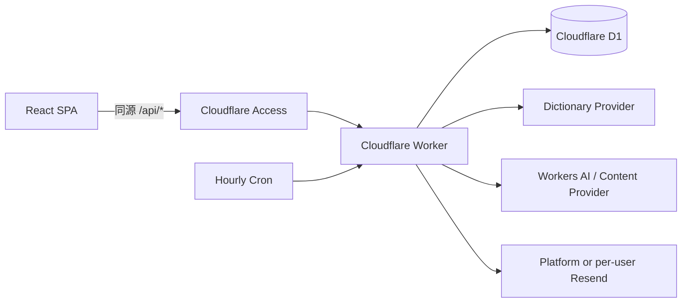

# 架构说明

## 总览



项目只有一个后端：与 React SPA 同项目部署的 Worker。静态资源导航与 `/api/*` 由 Cloudflare Vite 插件协调；写接口要求 Access JWT 和同源请求，不开放 CORS。

## 身份与租户隔离

Worker 验证 Access JWT 的 RS256 签名、issuer、audience、有效期和主体，再在 D1 中建立：

```text
Access identity → accounts → profile_id → all owned rows
```

`profile_id` 由 Worker 内部注入，不采信浏览器提供的用户标识。学习进度、打卡、测试、答案、错题、收藏、搜索历史、每日内容、邮件订阅、Provider 凭据和投递记录都按 profile 过滤。资源归属不匹配时返回 403/404，避免通过枚举 ID 确认其他用户数据是否存在。

登录邮箱只保存 SHA-256 哈希用于账号映射；收件邮箱在 D1 中保存规范化值和哈希，用唯一索引保证不能被两个账号重复绑定。更换收件邮箱不会移动 profile 或历史学习数据。

## 数据职责

- `accounts`、`auth_identities`、`account_events`：账号生命周期与 Access 身份映射。
- `app_profile`、`learning_progress`、`checkin_events`：业务时区、结清日期、已学习/未学习与同日撤销。
- `profile_daily_content`、`profile_daily_learning_packages`：每个用户每天独立且不可变的内容快照。
- `daily_content_components`：长期登记句子、词汇和实用表达的唯一指纹。
- `quiz_sessions`、`quiz_answers`、`mistake_book`：测评恢复、报告和掌握度。
- `dictionary_cache`、`dictionary_lexicon_*`：Provider 缓存与可选 Open English WordNet 回退。
- `users`、`email_provider_credentials`、`email_deliveries`：邮箱确认、加密的自带 Provider 配置与幂等投递状态。

## 每用户内容

内容变化键包含 `profile_id`、业务日期和生成尝试。候选必须经过运行时 schema、语言和长度限制、HTML 清理、禁用字段、版权边界、30 天相似度及长期组件唯一性检查。

同一用户同一天首次成功内容落 D1 后保持稳定，网页和邮件读取相同快照；不同用户的变化键与完整指纹不同。在线 Provider 不可用时回退种子，种子耗尽时明确失败而不是循环。

## 邮件 Provider

平台所有者可使用 Worker Secret 中的 Resend 配置。其他用户在设置页提供自己的 sending-access Key 与已验证发送域：

1. Worker 用非真人测试投递验证 Key 与发件域组合；
2. `USER_SECRET_ENCRYPTION_KEY` 派生 AES-GCM 密钥；
3. 每个 profile 使用独立附加认证上下文加密；
4. API 永不返回明文或密文 Key；
5. Cron 仅在目标用户到达本地发送小时后解密使用。

Cron 每个 UTC 整点运行。单用户异常被隔离记录，循环继续处理其他用户。投递键和 Resend `Idempotency-Key` 对应 profile、日期、类型和收件人哈希，同日并发不会重复发送。

## Provider 与安全边界

浏览器不直接访问第三方 API。Worker 封装内容、词典、翻译和邮件 Provider，统一执行输入/响应大小限制、超时、有限重试、结构校验、HTML 清理和脱敏错误映射。

Secret 只从 Worker Secret、本地未跟踪变量或用户加密信封读取。结构化日志不记录邮箱、邮件正文、Provider Key、Access token 或词典原始 payload。公共 CI 使用 mock，不需要真实生产凭据，也不会发信。

更详细的内容、词典和测评设计见 `docs/`。
