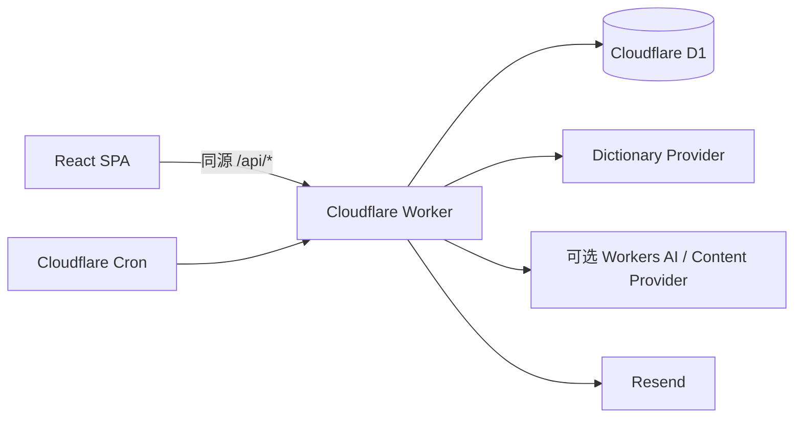

# 架构说明

## 总览

项目只有一个后端：与 React SPA 同项目部署的 Worker。静态资源导航和 `/api/*` 由 Cloudflare Vite 插件协调，API 不开放跨域写入。

## 数据职责

- `daily_content`：按业务日期保存不可变学习内容，网页和邮件共同读取。
- `daily_content_components`：长期登记句子、每日词汇和实用表达的唯一指纹。
- `learning_progress`、`checkin_events`：结清日期、已学习/未学习和同日撤销。
- `quiz_sessions`、`quiz_answers`、`mistake_book`：测评恢复、报告与掌握度。
- `dictionary_cache`、`dictionary_lexicon_*`：在线缓存与可选 Open English WordNet 回退。
- `users`、`email_deliveries`：单 Profile 邮箱确认和幂等投递状态机。

## Provider 边界

浏览器不直接访问第三方 API。Worker 封装内容、词典、翻译和邮件 Provider，统一执行输入限制、超时、有限重试、结构校验、HTML 清理和错误映射。

词典完整遍历 Provider 返回的 entries、词性和 senses。中文补充与原始英文来源分字段保存，不把生成内容伪装成词典原文。

## 单租户边界

当前 HTTP 请求统一使用 `default` Profile。Cloudflare Access 负责限制谁能访问私人实例，但 Access 身份尚未映射为不同 Profile。因此：

- 同一实例中的访问者共享学习进度、测评历史、错题和邮箱设置；
- 每日内容本身也按日期全实例共享；
- 需要多用户时，必须新增稳定主体标识、Profile 映射、逐查询授权与数据迁移，不能仅在前端切换邮箱。

## 邮件一致性

Cron 按 `APP_TIME_ZONE` 计算业务日期，先确保 `daily_content` 存在，再从同一记录渲染 HTML 与纯文本。`delivery_key` 和 Resend `Idempotency-Key` 稳定对应日期、投递类型与收件人哈希。

## Secret 与可观测性

Secret 只从 Worker Secret 或本地未跟踪配置读取。结构化日志只记录事件名、脱敏错误码、日期和状态，不记录邮箱、邮件正文、Provider key 或词典 payload。

更详细的内容、词典和测评设计见 `docs/`。
