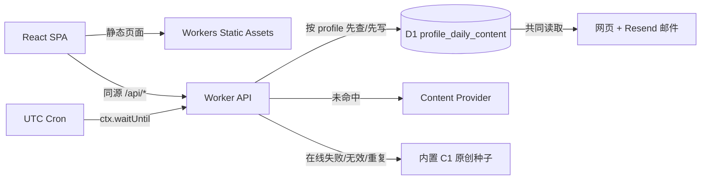

# MorrowLilt Cloudflare 架构基线

| 项目     | 决定                                             |
| -------- | ------------------------------------------------ |
| 文档状态 | 生产运行基线与完整词典回退                       |
| 核对日期 | 2026-08-22                                       |
| 默认拓扑 | React SPA + 同源 Worker API + D1 + Cron + Resend |
| 后端数量 | 1 个 Worker；默认不增加第二个服务                |
| 业务时区 | `APP_TIME_ZONE`，必须是 IANA 时区                |

## 1. 官方依据与 schema 核对

- Cloudflare Vite 插件使 Worker 在本地 `workerd` 中运行，并同时构建 SPA 与 Worker。[Vite 插件](https://developers.cloudflare.com/workers/vite-plugin/)
- React SPA 使用 `assets.not_found_handling = "single-page-application"`；`run_worker_first: ["/api/*"]` 明确让 API 先进入 Worker，页面路由继续回退至 `index.html`。[SPA 路由](https://developers.cloudflare.com/workers/static-assets/routing/single-page-application/)
- D1 通过进程内 binding 调用，动态值使用 prepared statement 与 `bind()`。[D1 Worker API](https://developers.cloudflare.com/d1/worker-api/)、[Prepared statements](https://developers.cloudflare.com/d1/worker-api/prepared-statements/)
- Cron Trigger 按 UTC 执行，调用模块 Worker 的 `scheduled()`；因此不能把服务器默认时区当业务日。[Cron Triggers](https://developers.cloudflare.com/workers/configuration/cron-triggers/)
- 绑定类型通过 `wrangler types` 从兼容日期、flags 和配置生成。[Workers TypeScript](https://developers.cloudflare.com/workers/languages/typescript/)
- 本仓库另用 `node_modules/wrangler/config-schema.json` 验证了 `assets`、`run_worker_first`、`d1_databases`、`ai`、`triggers` 与 `observability` 的当前字段结构。Wrangler 版本由锁文件固定。

## 2. 架构决策

### ADR-001：单项目、单 Worker、同源 API

React 静态资源和 Worker 一起由 Cloudflare Vite 插件构建。`/api/*` 由 Worker 先处理；其他未命中静态资源的导航由 SPA fallback 返回 `index.html`。这避免 CORS、第二套部署和服务间鉴权，也符合当前个人产品规模。

### ADR-002：按账号生成的每日快照先落 D1

网页和邮件都只消费 `profile_daily_content` 中重新读取出的持久化快照，不直接消费 Provider 的临时返回。日期相同但 `profile_id` 不同会使用不同的变化键和指纹；同一账号刷新仍读取原快照。流程固定为：

1. 查询该账号当日 `(profile_id, content_date)`，已有即返回，不改写。
2. 未命中时尝试在线 `ContentProvider`。
3. 在线失败、无效或与近期内容高度相似时，有限重试候选。
4. 在线候选仍不可用时，随机选择与近期内容不同的内置 C1 原创种子。
5. 以 `(profile_id, content_date)` 唯一键写 D1；同日期指纹也不得与其他账号相同，冲突时重新选择。
6. 写入后重新读取，再供 `/api/daily-content` 或邮件使用。

这保证网页与邮件内容一致，也满足“某业务日首次快照稳定”的产品规则。

### ADR-003：Provider 作为边界接口

`worker/providers/contracts.ts` 定义：

- `DictionaryProvider`：返回全部词性、释义、例句及归属信息；D1 Open English WordNet 作为本地大词库合并/回退。
- `ContentProvider`：按业务日和时区生成结构化每日内容。
- `TranslationProvider`：显式源/目标语言和归属信息。
- `EmailProvider`：发送已渲染、带幂等键的每日摘要。

阶段 3 实现通用 HTTP Content Provider 与 Resend Email Provider；词典与翻译只建立稳定接口，后续接入时复用同一外部请求策略。

### ADR-004：IANA 业务时区，不读取服务器默认值

`APP_TIME_ZONE` 是受版本控制的非敏感配置，当前本地默认 `Asia/Shanghai`。代码用 `Intl.DateTimeFormat(..., { timeZone })` 计算 `YYYY-MM-DD` 与本地小时，并在启动路径验证 IANA 名称。Cloudflare 本地和线上 runtime 默认 UTC 不会改变业务日。

Cron 每 5 分钟触发一次。Worker 对每个已确认订阅分别用其 IANA 时区计算本地小时，只处理到达个人发送小时的账号。私人所有者继续由平台 Secret 在 `Asia/Shanghai` 23 点这一小时内发送；其他账号必须先在设置页提供自己的 Resend API、已验证发件身份、时区与发送小时。日期唯一约束与 Resend `Idempotency-Key` 共同避免重复发送，同小时的后续触发可恢复瞬时故障。

### ADR-005：外部请求必须受控

所有当前外部网络调用统一经过 `fetchJsonWithPolicy`：

- 默认 5–6 秒超时；父级取消信号可向下传播。
- 最多 2 次，只有网络失败、超时、429 和 5xx 可有限重试。
- 响应按流累计并限制大小，随后解析 JSON。
- Provider 返回必须通过运行时结构校验，不能用类型断言信任外部数据。
- 错误日志只记录 operation、可观测错误码、状态和尝试次数，不记录授权头、邮箱、正文或私有 Provider 域名。

主要错误码：`EXTERNAL_TIMEOUT`、`EXTERNAL_HTTP_ERROR`、`EXTERNAL_INVALID_JSON`、`EXTERNAL_INVALID_PAYLOAD`、`EXTERNAL_RESPONSE_TOO_LARGE`、`D1_HEALTH_CHECK_FAILED`、`CONTENT_ONLINE_FAILED`、`EMAIL_NOT_CONFIGURED`。

### ADR-006：无请求级全局状态、无 floating Promise

模块级只保留不可变常量和函数。请求 ID、Provider 实例、AbortController、业务日期均在单次调用中创建。每个 Promise 都被 `await`、`return` 或交给 `ctx.waitUntil()`；`scheduled()` 将整个调度任务传给 `ctx.waitUntil()`，不解构 `ctx`。

### ADR-007：账号所有权、连续结清边界与事件审计

Cloudflare Access 的已验证 `issuer + subject` 映射到内部 `account` 和永久 `profile_id`。所有学习、测试、错题、收藏、历史和邮箱查询都从 Worker 注入的账号上下文取 `profile_id`，不接受浏览器提交的 profile。登录邮箱只用于身份映射；更换订阅邮箱不会改变 profile 或历史。账号停用保留数据，明确重新授权后恢复同一 profile。首次创建 profile 的触发器把 `settled_through_date` 初始化为 `created_date - 1 day`，因此不会补建部署或启用前的学习内容。

“已学习”由同一 D1 `batch()` 中的条件事件写入和条件进度更新完成；D1 会把 batch 当作事务顺序执行，任一语句失败则整体回滚。事件保存 `previous_settled_date`，同业务日撤销时只恢复该值。所有修改请求都要求 8–128 字符的幂等键；数据库唯一约束、条件更新和事件反向唯一索引共同阻止重复点击、并发结清和重复撤销。

待学包查询范围固定为 `(settled_through_date, today]`，按 `content_date ASC` 返回，不使用会静默丢内容的 `LIMIT`。每个缺失日期先经过同一 `ensureDailyContent()` 降级链并落 D1，再统一读取；当前实现返回全量，未来如增加游标分页，响应必须附带可继续加载到末尾的元数据。

## 3. 数据模型

### `daily_content`

- `content_date`：业务日唯一键。
- `content_json`：通过 schema v1 校验的完整快照。
- `content_hash`：SHA-256，用于版本检查与审计。
- `source`：新内容使用 `online | seed`；`cache` 与 `source_date` 仅保留为历史兼容字段。
- Provider、版本、归属和生成时间与快照一起保存。

### `accounts`、`auth_identities` 与 `profile_daily_content`

- `accounts.login_email_hash` 唯一，不保存 Access 登录邮箱明文；`auth_identities(issuer, subject)` 唯一并支持撤销、重新授权和并发首次登录。
- `profile_daily_content(profile_id, content_date)` 唯一；同一日期的完整指纹跨账号唯一。内容一旦写入就保持稳定。
- `profile_daily_content_components` 记录账号已使用的句子、词汇、表达和话题组件；在线 Provider 不可用且种子无法满足去重时明确失败，不静默循环。
- API 查询测试会话时同时匹配 `profile_id + session_id`，因此猜测其他账号的随机会话 ID只会得到 404。

### `email_deliveries`

- `delivery_key` 唯一；定时投递格式为 `daily-ielts/<local_date>/<recipient_hash>`，同一值也作为 Resend `Idempotency-Key`。
- 状态为 `pending | sending | sent | failed`。`sending` 使用有限租约和条件更新，同日并发触发只有一个请求可以取得发送权。
- 最多尝试 3 次；只有 429、5xx、超时和网络错误可重试。错误只保存脱敏代码。
- 只保存收件地址 SHA-256、Provider message id 和状态元数据，不保存邮箱明文、授权头或邮件正文。
- `profile_id` 是投递唯一约束的一部分；调度逐用户捕获错误，一个 Provider 失败不会中断其他收件人。
- 私人所有者使用平台 `RESEND_API_KEY` Secret；其他账号的自带 key 使用 AES-GCM 信封加密后存入 D1，解密主密钥只存在 `USER_SECRET_ENCRYPTION_KEY` Worker Secret，API 永不回显 key。
- Provider 成功后若 D1 更新失败，租约到期后仍用同一幂等键恢复；24 小时窗口过期后不自动重发模糊状态。

### `app_profile`、`learning_progress`、`checkin_events`

- `app_profile.created_date` 是 ISO 本地日期；profile 保存已确认的 IANA 时区，不依赖服务器默认时区。
- `learning_progress` 每个 profile 恰有一行，保存连续结清边界、乐观版本号和更新时间。
- `checkin_events` 记录 `learned | not_learned | undo`、业务日、前后边界、幂等键及被撤销事件；外键和唯一索引保证审计链一致。
- `not_learned` 只写审计事件，不更新进度；读取页面或未点击不会写事件，也不会推进结清边界。

### `dictionary_lexicon_*` 与翻译缓存

- `dictionary_lexicon_senses` 保存 Open English WordNet 2025 的规范词条、词性、全部义项、例句和同义词；`dictionary_lexicon_forms` 保存不规则词形到 lemma 的映射。
- `dictionary_translation_cache` 以源文本 SHA-256 唯一，避免相同英文义项重复翻译；`dictionary_suggestion_cache` 缓存联想词 24 小时。
- 旧 `daily_topics` 表作为历史 migration 保留，但产品已移除口语页面、话题 API 与后台话题生成链。新的每日学习包只从 `daily_content` 生成。

### 版本化 migrations

| Migration                                     | 内容                                                                |
| --------------------------------------------- | ------------------------------------------------------------------- |
| `0001_initial.sql`                            | `daily_content`、`email_delivery`、快照与邮件唯一索引               |
| `0002_learning_state.sql`                     | profile、学习进度、打卡事件、初始化触发器、日期约束、外键与并发索引 |
| `0003_content_pipeline.sql`                   | 内容 v2 元数据、指纹索引和管理员再生成审计表                        |
| `0004_quiz_assessment.sql`                    | 测试会话、答案快照和错题掌握度                                      |
| `0005_dictionary_cache.sql`                   | 词典缓存、规范化历史、收藏和复习队列                                |
| `0006_daily_topics.sql`                       | 按日期/轨道固化的话题、练习状态、复习事件和纠错反馈                 |
| `0007_email_deliveries.sql`                   | 邮件状态机、投递键、租约、有限重试与收件地址哈希                    |
| `0008_email_subscriptions.sql`                | 邮箱绑定、确认与退订状态                                            |
| `0009_daily_learning_packages.sql`            | 每日学习包快照与语义哈希                                            |
| `0010_dictionary_lexicon.sql`                 | 大词库、联想缓存与中文翻译缓存                                      |
| `0011_remove_topic_from_daily_package.sql`    | 移除学习包的话题依赖与旧口语/写作派生快照                           |
| `0012_daily_content_component_uniqueness.sql` | 单账号内容组件避重索引                                              |
| `0013_multi_user_accounts.sql`                | 账号、Access 身份、生命周期审计与加密邮件配置                       |
| `0014_profile_daily_content.sql`              | 按账号每日内容与学习包快照                                          |
| `0015_profile_email_deliveries.sql`           | 按账号重建邮件状态机与投递日志视图                                  |

## 4. 运行图

Mermaid 源文件：[architecture.mmd](./architecture.mmd)



## 5. 路由与运行时

| 路径/事件                                  | 行为                                                        |
| ------------------------------------------ | ----------------------------------------------------------- |
| `/api/health`                              | 执行 `SELECT 1`，D1 正常返回 200，否则返回结构化 503        |
| `/api/daily-content?date=YYYY-MM-DD`       | 解析或生成、先持久化、再返回每日快照                        |
| `GET /api/today`                           | 创建/读取 profile，返回完整升序待学包、今日快照和结清状态   |
| `POST /api/checkin`                        | 校验 `{action}` 与幂等键；原子执行 `learned/not_learned`    |
| `POST /api/checkin/undo`                   | 仅同业务日撤销最近可撤销的 learned 事件并恢复此前结清边界   |
| `POST /api/admin/daily-content/preview`    | 管理员鉴权后预览候选，不落库                                |
| `POST /api/admin/daily-content/regenerate` | 管理员鉴权、幂等审计后明确替换已有快照                      |
| `POST /api/admin/email/preview`            | 管理员鉴权后渲染 HTML 与纯文本，不发送                      |
| `POST /api/admin/email/test-send`          | 管理员显式触发；默认使用 Resend 测试目标                    |
| `GET /api/dictionary`                      | 合并在线词典与 D1 WordNet，补齐全部中文释义和词形           |
| `GET /api/dictionary/suggestions`          | 返回历史、本地词库与可用在线联想词                          |
| `GET /api/settings`                        | 返回当前写作学习轨道                                        |
| `POST /api/settings`                       | 验证并保存 Academic 或 General Training 轨道                |
| `GET/DELETE /api/account`                  | 查询或停用当前账号；停用保留历史                            |
| `POST /api/account/reauthorize`            | 重新启用原账号与原 profile                                  |
| `GET/POST /api/email/settings`             | 当前账号邮箱状态；非所有者可加密保存自带 Resend 与发送时间  |
| 其他 `/api/*`                              | Worker 返回结构化 404，不落入 SPA                           |
| `/today` 等前端路径                        | Static Assets 找不到文件后返回 SPA `index.html`             |
| `scheduled()`                              | 通过 `ctx.waitUntil()` 生成当日内容并在发送时段尝试幂等邮件 |

## 6. 配置差异

相对阶段 2，`wrangler.jsonc` 新增或收紧：

- `assets.run_worker_first: ["/api/*"]`。
- `vars.APP_TIME_ZONE`。
- `d1_databases[DB]`、本地 preview id 与 migrations 目录。
- 每 5 分钟 Cron；Worker 按每个账号的 IANA 时区和本地小时筛选，并在同小时内自动重试瞬时故障。
- observability 采样配置。
- `wrangler.example.jsonc` 提供可选远程 Workers AI binding；默认配置不启用 AI，避免本地开发隐式产生远程用量。启用后必须重新运行 `pnpm cf-typegen`。

当前 schema 只要求 D1 `binding`，所以受版本控制的实际配置省略远程 `database_id`；本地通过 `preview_database_id` 使用模拟数据库。若团队不采用 Cloudflare 自动资源配置，远端 ID 只能放进私有未跟踪配置。

## 7. 未注入变量与资源

| 名称                         | 放置位置                                      | 是否必需               |
| ---------------------------- | --------------------------------------------- | ---------------------- |
| `D1_DATABASE_ID`             | 私有 Wrangler 配置中的真实 D1 id              | 远端部署必需           |
| `CONTENT_PROVIDER_URL`       | `.dev.vars` 或私有配置                        | 在线内容可选           |
| `CONTENT_API_KEY`            | Worker Secret / `.dev.vars`                   | 视 Provider 而定       |
| `MAIL_SEND_HOUR_LOCAL`       | `.dev.vars` 或后续 D1 用户设置                | 邮件必需，0–23         |
| `ADMIN_API_KEY`              | Worker Secret                                 | 管理接口必需           |
| `RESEND_API_KEY`             | Worker Secret / `.dev.vars`                   | 邮件必需               |
| `USER_SECRET_ENCRYPTION_KEY` | Worker Secret                                 | 多用户自带 Resend 必需 |
| `RECIPIENT_EMAIL`            | Worker Secret                                 | 邮件必需               |
| `MAIL_FROM`                  | Worker Secret                                 | 邮件必需               |
| `PUBLIC_SITE_URL`            | 非敏感 Worker var                             | 邮件链接启用时必需     |
| `AI` binding                 | `wrangler.example.jsonc` 中的可选远程 binding | 可选                   |

所有示例只含 `<PLACEHOLDER>`；真实邮箱、域名、token 和部署专属 ID 不进入受版本控制文件。Resend API 请求字段和返回 `id` 按其当前官方接口校验。[Resend Send Email](https://resend.com/docs/api-reference/emails/send-email)

## 8. 私人访问边界

- Cloudflare Access 负责站点入口登录；Worker 仍对每个生产 `/api/*` 请求校验 `Cf-Access-Jwt-Assertion` 的 RS256 签名、issuer、audience 与有效期，避免只依赖边缘配置。
- `ACCESS_TEAM_DOMAIN` 与 `ACCESS_AUD` 只从 Worker Secret 或私有未跟踪配置读取。生产环境缺少任一项时 API 失败关闭；仅 `localhost`、回环地址和测试保留域可跳过此门禁。
- 所有写请求必须同时满足同源 `Origin`、允许的 `Sec-Fetch-Site` 和站内请求标记；响应不启用跨域许可。定时任务直接进入 `scheduled()`，不依赖浏览器 Cookie。
- 浏览器端使用统一请求层、运行时 schema、取消信号与离线写入阻断；Cloudflare Access token、管理员字段和邮件配置不会进入客户端响应。

## 9. 本地验证

```bash
pnpm cf-typegen
pnpm db:migrate:local
pnpm dev
```

访问 `/api/health` 验证 D1，访问 `/api/daily-content` 验证快照。Vite 本地服务运行时，可请求 `/cdn-cgi/handler/scheduled?format=json` 验证 scheduled handler。测试环境通过 Cloudflare Vitest integration 读取并应用同一批 D1 migrations，不连接远程账号或数据库。
