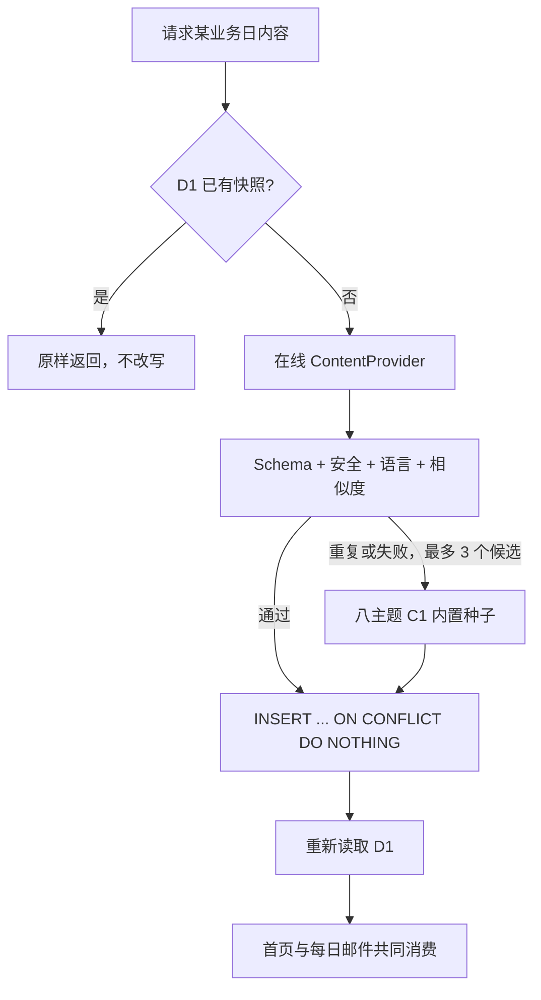

# 每日学习内容管线

| 项目         | 决定                                |
| ------------ | ----------------------------------- |
| 文档状态     | 阶段 5 可运行实现                   |
| 内容 schema  | `daily-content.schema.json`，版本 2 |
| 默认难度     | CEFR C1，允许 C2                    |
| 快照单位     | IANA 业务时区中的 ISO 本地日期      |
| 普通写入原则 | 同一业务日首次成功快照不可改写      |

## 1. “随机”与“同日不变”的产品决定

“每天每次打开随机”与“同日内容落库后不可被重复请求改写”存在直接冲突。按 PRD 的可复现性和最少惊讶原则，实现采用：

- 某业务日第一次生成时，从符合条件的在线候选或内置种子中随机选择并落 D1。
- 同一业务日之后每次打开都返回同一不可变快照，网页和邮件共同读取它。
- 新业务日重新生成，并排除近期相同指纹和高度相似内容，因此相邻日期内容与邮件不同。
- “每次测试都不一样”仍属于独立测试会话规则；不得通过刷新每日页偷偷更换已入库学习内容。

随机索引使用 Web Crypto `crypto.getRandomValues()` 的拒绝采样，不使用 `Math.random()`。随机性只影响首次候选选择，不影响已落库快照。

## 2. Schema v2

运行时契约位于 `worker/providers/contracts.ts`，可交换的完整 JSON Schema 位于 `worker/content/daily-content.schema.json`。每日内容包含：

- 英文句子和自然中文释义；
- 语法说明、语用说明；
- 常用搭配、替换表达、微练习；
- 至少三个带词性、中文释义、中英例句和用法提醒的单词、短语或表达；
- 恰好三条真实场景表达，每条含多个中文义项、核心语义、两个场景、中英例句、易错点、替换表达和正式语域迁移；
- `C1 | C2` 难度、八类主题之一；
- 原创、AI 辅助或授权来源类型；
- provider、可选 HTTPS `source_url`、内容指纹、生成器版本和不可变创建时间。

授权内容必须提供 HTTPS 来源；系统不会自行拼造来源链接。来源 URL 在保存前移除查询参数和片段，避免把临时签名或 Provider key 返回给前端。内容来源类型保留在服务端元数据中，不作为学习页面上的说明文字。

## 3. 三级回退

普通读取严格按以下顺序：

1. D1 已有记录；
2. 配置的在线 `ContentProvider`；
3. 内置高阶种子。

阶段 5 不再把前一天内容复制成当日缓存，因为这会违反跨日差异要求。在线 Provider 的网络请求仍有响应大小上限、超时和有限网络重试；内容层对无效或相似候选最多再请求三个候选，随后稳定回退。

## 4. 在线内容验证

保存前依次执行：

1. 递归拒绝 `apiKey`、`providerKey`、`token`、`secret`、`html`、`script`、`style`、`rawHtml`、`answerKey` 等禁用字段。
2. 对所有字符串去除 HTML 标签、脚本/iframe 编码片段、控制字符和 `javascript:` 前缀。
3. 校验 JSON Schema v2 的必填字段、枚举、数组数量、字符串长度和禁止额外字段。
4. 检查英文句子/例句的拉丁文字特征和中文释义的汉字特征。
5. 拒绝冒充官方题目、官方分数或 Cambridge IELTS 内容的声明。
6. 计算排除日期字段的 SHA-256 语义指纹；与最近 30 日逐一比较指纹和 token Jaccard 相似度。
7. 主句、任一词条、任一场景表达在最近 30 天精确重复，或整体相似度达到 `0.82`，即拒绝候选并有限重试。

日志只记录 Provider 的公开名称、业务日期、尝试次数和错误码，不记录 URL、授权头、候选正文或 key。

## 5. 种子库与难度

内置库覆盖：学习、校园、科技、环境、工作、健康、城市和文化。每份种子均为 C1 内容，含复杂句法、学术词汇、搭配、微练习和三条真实场景表达。自动测试逐份执行完整 schema 校验。

生产环境可启用 Workers AI 作为在线 Provider：提示词包含最近 30 天的句子、词条与场景表达摘要，候选仍需经过完整 schema、敏感主题、版权声明、XSS、语义哈希和相似度验证。Provider 失败时回退种子；如果 30 天窗口内所有候选都重复，系统明确失败并等待下一次有限重试，不会为了“发送成功”静默复用旧内容。

## 6. 不可变快照与管理员再生成

普通入口只调用幂等插入；`content_date` 唯一约束和 `ON CONFLICT DO NOTHING` 保留第一个成功版本。明确的管理员流程有两个端点：

- `POST /api/admin/daily-content/preview`：只生成预览，不落库。
- `POST /api/admin/daily-content/regenerate`：要求已有快照、原因和 `Idempotency-Key`，事务写审计后替换。

两者都要求 `Authorization: Bearer ...`，与私有 `ADMIN_API_KEY` 经 SHA-256 后使用 timing-safe 比较。未配置时返回 503，错误响应不会包含 key。再生成审计表保存替换前后 JSON、哈希、指纹、Provider、原因、幂等键和时间；重复幂等请求只产生一条审计。

## 7. 首页、发音和邮件

首页展示真实快照中的难度、主题、英文/中文、完整词汇信息、语法与语用、三条场景表达和微练习。欠学内容继续按日期升序分组折叠，并显示累计天数和项目数。

发音采用渐进增强：浏览器支持 Web Speech API 时显示“播放例句发音”，使用 `en-GB` 和较慢语速；不支持、无 voice 或播放失败时只显示文本提示，学习卡和打卡不受影响。未来如 Provider 提供许可清晰的音频 URL，可在保持同一降级行为的前提下优先使用音频文件。

Cron 邮件从同一 `daily_content` 快照读取英文句子、中文、完整词汇、三条场景表达、语法/语用注意和微练习。跨日指纹不同，因此邮件正文随业务日变化；同日邮件幂等键仍防止重复投递。

## 8. 配置与错误码

私有配置：`CONTENT_PROVIDER_URL`、`CONTENT_API_KEY`、`ADMIN_API_KEY`。示例文件只使用 `<PLACEHOLDER>`；线上通过 Worker Secret 注入。

主要错误码：`CONTENT_SCHEMA_INVALID`、`CONTENT_FORBIDDEN_FIELD`、`CONTENT_DATE_MISMATCH`、`CONTENT_AI_LABEL_REQUIRED`、`CONTENT_SOURCE_REQUIRED`、`CONTENT_OFFICIAL_CLAIM`、`CONTENT_RECENTLY_SIMILAR`、`ADMIN_NOT_CONFIGURED`、`ADMIN_UNAUTHORIZED`、`CONTENT_NOT_FOUND`。
